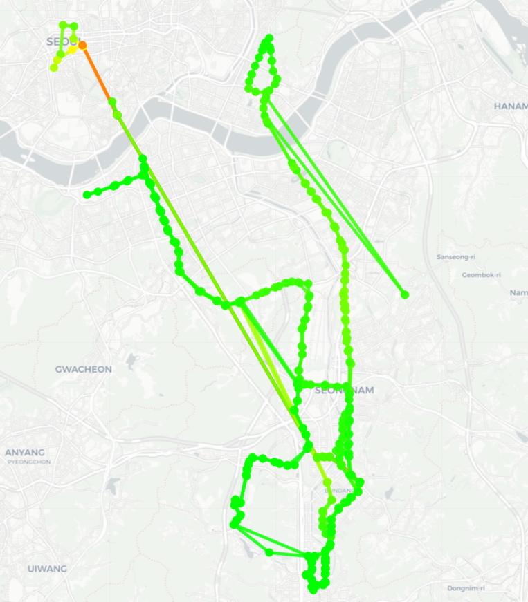
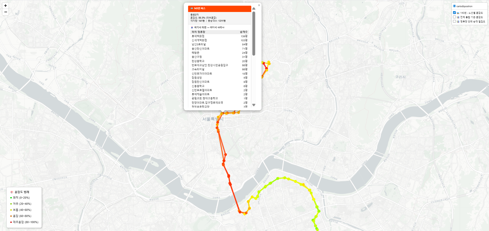
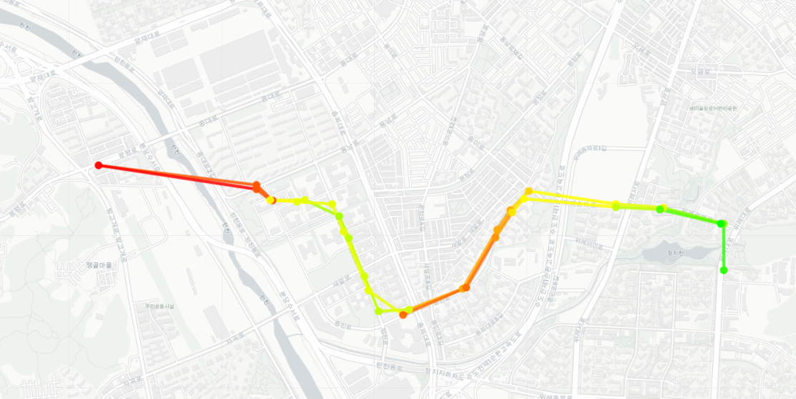
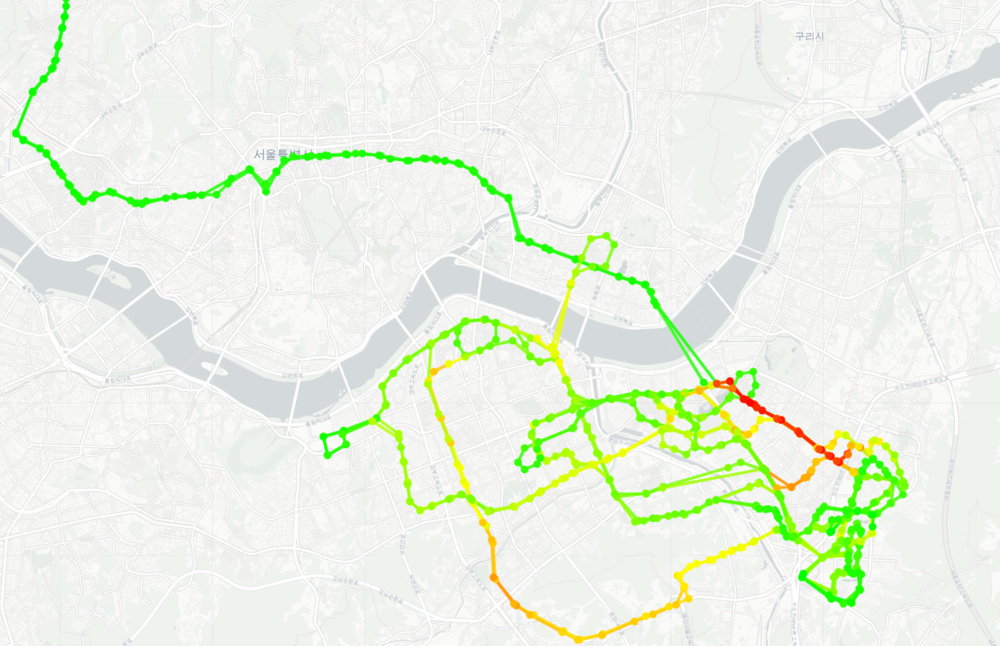
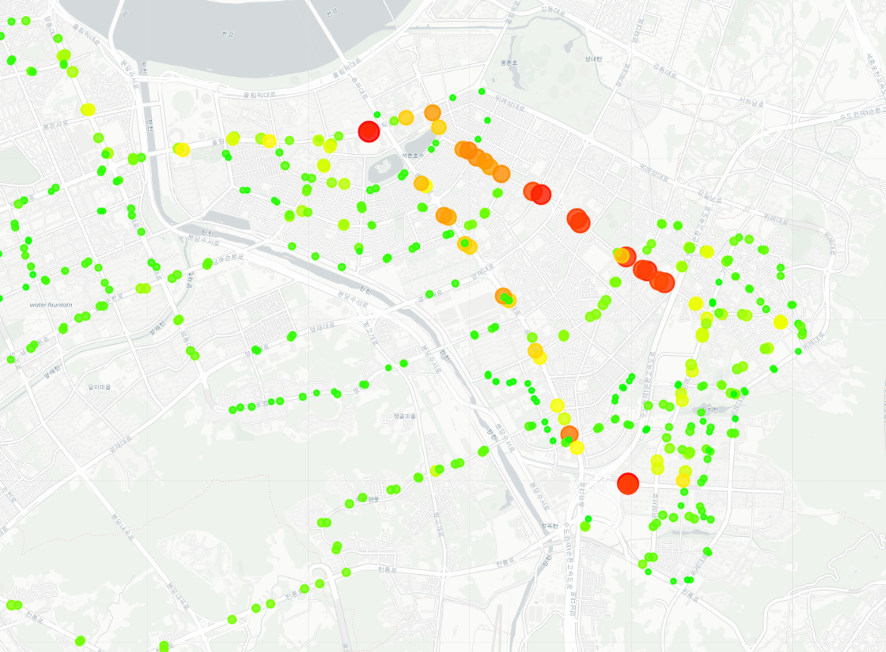
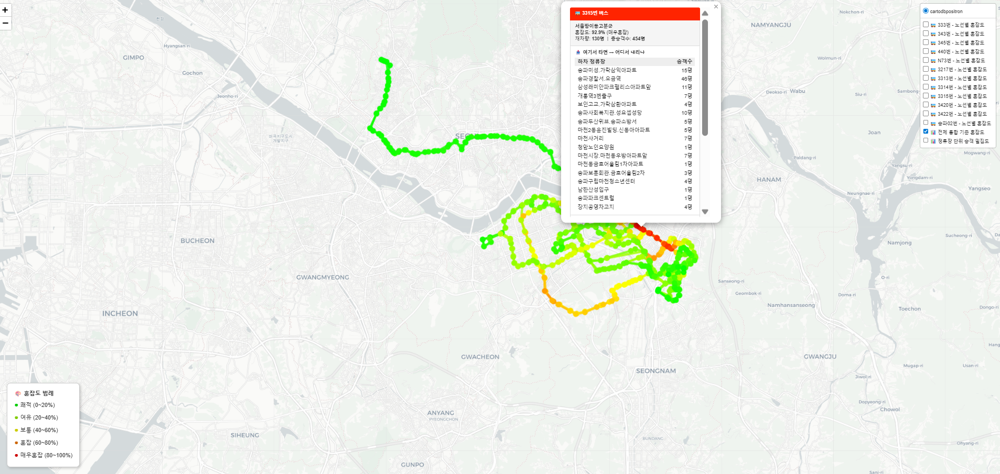

# 서울특별시 시내버스 OD(Origin-Destination) 데이터 분석 파이프라인

> 서울 버스 승하차(OD) 데이터를 활용한 정류장별 혼잡도 계산 및 인터랙티브 시각화 프로젝트
> 궁극적 목표: OD 분석 → **트립체인(Trip Chain) 분석 및 가공**으로 확장하여 이용자의 이동 패턴을 파악하고 이동 효율화의 데이터 근거 마련

[](https://ianx2933.github.io/Transit-Data_Seoul/03_visualization/congestion_map.html)

---

## 프로젝트 개요

서울시 버스 OD 원시 데이터를 전처리하고, 정류장 단위 재차량 및 혼잡도를 계산하여 인터랙티브 지도로 시각화하는 엔드 투 엔드 데이터 파이프라인을 구축했습니다.

- **데이터**: 서울시 버스 OD 데이터 (약 200만건)
- **분석 노선**: 143, 302, 303, 333, 343, 345, 422, 440, 4318, 9401, 9404, 9408 등
- **분석 기간**: 20231017, 20241019, 20251014 (날짜별 시계열 비교)
- **최종 목표**: 버스 OD 분석 → 트립체인 분석 → 이동 패턴 기반 서비스 개인화
---
## 트립체인 분석으로의 확장

이 프로젝트는 단순 혼잡도 시각화를 넘어, 트립체인 분석의 기초 단계입니다.

```
버스 출발지-도착지 수요 파악 및 분석
    ↓
환승 구간 및 시간대별 이동 패턴 축적
    ↓
트립체인 분석 (개인의 하루 이동 흐름 전체)
    ↓
이동 패턴 기반 노선 개편 및 서비스 개인화
```

트립체인 분석에서 이동 패턴 분석으로 생활을 분석하고 효율적인 서비스를 제공하려고 하는 것은 앱 로그 분석에서 행동 패턴으로 서비스를 개인화하는 것과 본질적으로 같은 방법론입니다. 이 프로젝트의 지향점은 데이터로 사람의 행동 패턴을 읽어내서, 그 패턴을 바탕으로 더 나은 경험을 설계하는 것입니다.

---

## 기술 스택

| 구분 | 기술 |
|------|------|
| 언어 | Java 21, Python 3.14, SQL |
| 프레임워크 | Spring Boot 4.0.4, JPA/Hibernate 7, SQL Server |
| DB | SQL Server |
| ORM | JdbcTemplate (CTE + 윈도우 함수) |
| 시각화 | Python Folium |
| 데이터 처리 | Pandas |
| 배포 | GitHub Pages |
| 버전관리 | Git / GitHub |
| 개발도구 | VS Code, SSMS, Maven, IntelliJ |

---

## 파이프라인 구조

```
원시 OD 데이터 (CSV)
        ↓
SQL Server DB 적재 (BULK INSERT)
        ↓
데이터 전처리 (Python + SQL)
- ARS 코드(5자리)와 정류장 표준코드(9자리) 대응될 수 있도록 가공
- 가상 정류장 승하차 제거 (ARS=00000)
- ARS 번호 Zero Padding 보정
- 승하차 순번 불일치 보정
- 표준코드 NULL 채우기
        ↓
Spring Boot REST API
- 재차량 계산 (CTE + 윈도우 함수)
- 19시간(서울 내 버스가 운행하는 평균적인 시간대) 기준 시간당 평균 보정
- 혼잡도 등급 산정 (5단계)
- 위경도 조인 (ARS + 정류장명 복합)
- 출발-도착 구간 혼잡도 조회 API
        ↓
Python Folium 시각화
- 날짜별 레이어 (2023 / 2024 / 2025 시계열 비교)
- 3개 레이어 (노선별 / 통합 / 밀집도)
- OD 팝업 (승차목적지 / 하차출발지)
- CSV 캐싱으로 성능 최적화
        ↓
GitHub Pages 배포
인터랙티브 혼잡도 지도
```
## 재차량 계산 알고리즘
재차량은 버스 내 실제 탑승 인원을 의미하며, 다음 누적 공식으로 계산합니다.
재차량(n번 정류장) = 재차량(n-1번) + 승차(n번) - 하차(n번)
이 계산은 노선 전체 순번이 정확해야 하므로, 데이터 품질 관리 문제가 전부 해결된 이후에 구현 가능합니다. 전처리 파이프라인이 이 계산의 정확성을 보장합니다.
SQL 구현 (CTE + 윈도우 함수)

```sql
WITH 순승객 AS (
    -- 승차: 양수로 합산
    SELECT 노선명, CAST(승차_정류장순번 AS INT) AS 순번,
        승차_정류장ARS AS ARS, 승차_정류장명 AS 정류장명,
        SUM(승객수) AS 순승객수
    FROM Analysis_Table_Final
    WHERE 노선명 = ? AND 기준일자 = ?
    AND 승차_정류장ARS != '00000'
    GROUP BY 노선명, 승차_정류장순번, 승차_정류장ARS, 승차_정류장명

    UNION ALL

    -- 하차: 음수로 합산
    SELECT 노선명, CAST(하차_정류장순번 AS INT) AS 순번,
        하차_정류장ARS AS ARS, 하차_정류장명 AS 정류장명,
        -SUM(승객수) AS 순승객수
    FROM Analysis_Table_Final
    WHERE 노선명 = ? AND 기준일자 = ?
    AND 하차_정류장ARS != '00000'
    GROUP BY 노선명, 하차_정류장순번, 하차_정류장ARS, 하차_정류장명
),
정류장별합산 AS (
    SELECT 노선명, 순번, ARS, 정류장명,
        SUM(순승객수) AS 정류장순승객   -- 승차 - 하차 = 순승객
    FROM 순승객
    GROUP BY 노선명, 순번, ARS, 정류장명
),
재차량계산 AS (
    SELECT 노선명, 순번, ARS, 정류장명,
        SUM(정류장순승객) OVER (         -- 윈도우 함수로 누적 합산
            PARTITION BY 노선명
            ORDER BY 순번
            ROWS BETWEEN UNBOUNDED PRECEDING AND CURRENT ROW
        ) AS 재차량
    FROM 정류장별합산
)
SELECT 노선명, 순번, ARS, 정류장명,
    -- 음수 보정 + 19시간 평균
    CASE WHEN 재차량 < 0 THEN 0
         ELSE ROUND(재차량 / 19.0, 0) END AS 재차량,
    -- 혼잡도 (노선 내 최대 재차량 대비 %)
    ROUND(재차량 * 100.0 / NULLIF(MAX(재차량) OVER (PARTITION BY 노선명), 0), 1) AS 상대혼잡도
FROM 재차량계산
ORDER BY 순번
```

---

## 인터랙티브 혼잡도 지도

**[지도 바로보기](https://lanx2933.github.io/Transit-Data_Seoul/03_visualization/congestion_map.html)**

### 레이어 구성
- **노선별 독립 혼잡도**: 각 노선별 재차량 기준 혼잡도 (노선별 독립 레이어)
- **전체 통합 기준 혼잡도**: 전체 노선 통합 기준 비교
- **정류장 단위 승객 밀집도**: 정류장별 총 재차량 합산

### 팝업 기능
- 정류장 클릭 시 혼잡도(%), 재차량, 총승객수 표시
- 여기서 타면 → 어디서 내리는지 (노선 순번 순)
- 어디서 타고 → 여기서 내리는지 (노선 순번 순)

---

## 시각화 결과물 (예시)

### 1. 노선 전체 혼잡도 (노선별 독립 레이어)
> 분석 대상 노선 전체의 혼잡도를 한눈에 확인할 수 있습니다.
> 초록(쾌적) → 노랑(보통) → 빨강(매우혼잡) 그라데이션으로 구간별 혼잡도를 직관적으로 표현했습니다.



---

### 2. 143번 혼잡 구간 분석
> 143번 버스의 종로2가-고속터미널 구간이 매우혼잡(빨강) 등급으로 나타나며,
> 해당 구간은 실제 민원이 빈번한 구간이며, 다람쥐버스 투입 적정 구간으로 판단하기에 충분합니다.
> 따라서 해당 구간의 다람쥐버스 투입 적정 구간으로 도출된 근거 이미지입니다.



---

### 3. 송파02 노선 혼잡도 (구간별 상세)
> 마을버스 송파02의 상세 혼잡도입니다.
> 특정 구간(빨강)에서 혼잡이 집중되는 패턴을 확인할 수 있으며,
> 출발지/도착지 방향에 따라 혼잡도가 달라지는 비대칭 패턴이 나타납니다.



---

### 4. 위례 지역 전체 노선 혼잡도
> 위례신도시 일대를 경유하는 전체 노선 혼잡도입니다.
> 거여-잠실 방면의 오금로 구간에서의 혼잡도가 증가하는 양상을 확인할 수 있으며,
> 위례신도시 내부는 수요가 떨어지는 것을 확인할 수 있습니다.



---

### 5. 위례 지역 정류장 단위 승객 밀집도
> 정류장별 전 노선 합산 재차량을 원의 크기와 색상으로 표현한 밀집도 레이어입니다.
> 원이 클수록, 빨갈수록 해당 정류장에 승객이 집중됨을 의미합니다.
> 환승 허브나 주요 목적지 정류장을 한눈에 파악할 수 있습니다.



---

### 6. OD 팝업 + 레이어 컨트롤 전체 화면
> 정류장 클릭 시 OD 팝업이 표시되며, 우측 레이어 컨트롤 패널에서 노선별 레이어를 선택할 수 있습니다.
> 이 OD 팝업이 트립체인 분석의 기초 단계입니다.



## 데이터 기반 인사이트 도출

단순 시각화를 넘어, OD 데이터를 활용하여 실제 대중교통 정책에 적용 가능한 인사이트를 도출했습니다.

---

### 1. 143번 종로2가 - 고속터미널 구간: 다람쥐버스 투입 근거

혼잡도 시각화 결과, **143번 버스의 종로2가 - 고속터미널 구간**이 매우혼잡(빨강) 등급으로 나타났으며 실제 민원이 빈번한 구간입니다.


**분석 결과**:
- 해당 구간은 143번 전체 노선 중 혼잡도가 가장 높은 구간
- 기존 대형버스만으로는 수요 커버에 한계 존재
- 혼잡 구간에 출퇴근 집중배차 맞춤버스(다람쥐버스) 투입 시 분산 효과 기대

> **정책 제언**: 종로2가 - 고속터미널 구간에 다람쥐버스를 투입하여 혼잡 완화 및 민원 감소 효과를 도모할 수 있습니다.

---

### 2. 302번 노선 개편: 상대원 - 중앙시장 구간 경기도 시내버스 분리 검토

302번과 303번이 **서로 겹치지 않게 운행하지 않는 구간(상대원차고지 ~ 성호시장)**의 하차 수요를 분석했습니다.

| 정류장 | 순번 | 하차승객수 |
|--------|------|-----------|
| 성남시의료원.신흥1동행정복지센터 | 19 | **390명** |
| 성일중고.성일정보고.동광중고 | 16 | 161명 |
| 성남종합운동장.성남동행정복지센터 | 15 | 191명 |
| 중앙시장 | 21 | 139명 |
| 성호시장입구.단대리약국 | 18 | 132명 |
| 중원구청 | 14 | 74명 |
| 대하초등학교.중원유스센터 | 10 | 60명 |
| 아튼빌후문 | 11 | 48명 |

**유효 수요 판명 기준**: 행정기관 및 학계에서 통용되는 기준으로,
환승이 발생하는 인원이 **50명을 초과할 경우** 민원 처리가 불가능한 수준으로 판단합니다.

**분석 결과**:
- 성남시의료원(390명), 성남종합운동장(191명), 성일중고(161명) 등 상위 정류장 집중
- 중앙시장(순번 21) 이후 수요 급감
- 302번과 303번이 겹치지 않는 해당 구간은 서울행 수요 발생보다는 성남 생활권 중심의 수요 패턴을 보임

> **정책 제언**: 상대원차고지 - 중앙시장 구간은 수요 패턴상 경기도 시내버스로 분리 운행하는 것이 노선 효율화 측면에서 유리
> 302번을 복정역으로 단축하여 복정역 - 상왕십리역을 운행할 경우에 지금보다 노선 운행 효율을 높일 수 있음.

---

### 3. 노선 수요 집중 구간 정량화 → 노선 개편 당위성 확보

OD 데이터를 구간별로 필터링하여 **전체 수요 대비 특정 구간의 집중도**를 정량화했습니다.

#### 303번 / 302번 분석 결과
| 노선 | 구간 | 구간승객수 | 전체대비 |
|------|------|-----------|---------|
| 303 | 상대원 ↔ 잠실역 (왕복) | 14,319명 | **56.3%** |
| 303 | 상대원 ↔ 통계청.태평역 (왕복) | 4,939명 | 19.4% |
| 302 | 상대원 ↔ 잠실역 (왕복) | 9,559명 | **51.2%** |
| 302 | 상대원 ↔ 통계청.태평역 (왕복) | 3,404명 | 18.2% |

#### 4425번 분석 결과
| 노선 | 구간 | 구간승객수 | 전체대비 |
|------|------|-----------|---------|
| 4425 | 상대원 ↔ 복정역 | 2,264명 | 28.6% |
| 4425 | 은곡마을 ↔ 삼성역 (왕복) | 4,457명 | **56.3%** |

> **인사이트**: 302번, 303번, 4425번 모두 전체 수요의 50% 이상이 특정 핵심 구간에 집중되어 있습니다.
> 이것을 봤을 때, 해당 구간의 증편 또는 노선 변경의 데이터 기반 근거가 될 수 있으며, 수요가 낮은 구간은 해당 데이터를 기반으로 노선 효율화가 가능합니다.

---

### 4. 분석 방법론의 확장 가능성

### 4. 트립체인 분석으로의 확장 가능성

OD 분석은 트립체인 분석의 기초 단계입니다. 현재는 단일 날짜 기반의 단일 노선의 하루 승하차 패턴을 보여주지만, 다음 단계로 확장 가능합니다.

- **시간대별 분석**: 출퇴근 vs 낮 시간대 이동 패턴 및 혼잡도 비교 → 탄력 배차 시행의 근거로 될 수 있음.
- **환승 패턴 분석**: 어떤 정류장에서 환승이 가장 많이 발생하는지, 그리고 어떤 노선끼리 환승이 가장 많이 발생하는지에 대하여 분석 가능
- **개인 이동 흐름**: 출발지에서 목적지로 향하는 전체 경로를 하나의 흐름으로 분석
- **데이터안심구역 연계**: 현재는 개인정보보호법 상 데이터안심구역을 통해서만 접근 가능한 심층 데이터(환승 패턴, 이용자 유형별 원시 데이터)를 활용한 분석 예정

---

## 핵심 분석 지표

### 혼잡도 등급 기준
| 등급 | 범위 | 색상 |
|------|------|------|
| 쾌적 | 0~20% | 초록 |
| 여유 | 20~40% | 연두 |
| 보통 | 40~60% | 노랑 |
| 혼잡 | 60~80% | 주황 |
| 매우혼잡 | 80~100% | 빨강 |

### 재차량 계산 방식
- 서울 버스 운행시간 (04-23시 또는 05-00시 = 19시간) 기준 시간당 평균 재차량
- CTE + 윈도우 함수(SUM OVER)로 정류장별 누적 재차량 계산
- 차고지 음수 재차량 → 0으로 보정

---

## 핵심 구현 내용

### 1. 데이터 전처리
- 가상 정류장(ARS=00000) 필터링
- ARS + 정류장명 복합 조인으로 오매칭 방지
- 서울/경기 광역 노선 모두 지원 (좌표 범위 필터)
- 정류장명 불일치로 인한 NULL 비율: 약 1.5% 미만

### 2. 혼잡도 계산 API 엔드포인트
```
GET /api/congestion/{노선명}              단일 노선 혼잡도
GET /api/congestion?routes=143,345,4318  복수 노선 혼잡도
GET /api/od/{노선명}/{ARS}               정류장별 OD
GET /api/od/all                          전체 노선 OD
```

### 3. 성능 최적화
- CSV 캐싱으로 API 재호출 최소화
- OD 데이터 딕셔너리 변환으로 팝업 생성 속도 향상
- 전체 파이프라인 실행 시간 압도적으로 단축 (약 30분 → 10-15초)

---

## 시행착오 및 문제 해결

### 1. 시각화 도구 3번 교체: Tableau → QGIS → Folium

**Tableau 시도**
- 커스텀 좌표 매핑 복잡, 정류장별 동적 색상 표현 한계 → 도입은 했으나 OD 분석 시각화에는 부적합 판단

**QGIS 시도**
- 구간별 혼잡도 색상 표현 성공했으나 정적 이미지만 생성 가능
- 정류장 클릭, OD 팝업 등 인터랙티브 기능 구현 불가

**Python Folium 최종 채택** ✅
- Spring Boot API와 직접 연동, 동적 데이터 시각화 구현 가능, GitHub Pages로 URL 하나로 공유 가능
- 노선별 레이어 분리 가능, OD 팝업, 혼잡도 그라데이션 모두 구현 가능

---

### 2. ARS 코드만 존재 → 표준코드 9자리 매칭 오류

**문제**: 원본 OD 데이터에는 ARS 코드(5자리)만 존재하고, 위치 마스터 데이터에는 표준코드(9자리)만 존재 → 공통 키 없음

**시도 1**: ARS 단독 조인 → 서울/경기 동일 ARS 중복 문제 발생

**시도 2**: 표준코드 조인 → 원본 데이터에 경기도 표준코드 오입력 케이스 발견, MAX() 사용 시 경기도 코드 선택되는 문제

**최종 해결**: ARS + 정류장명 복합 조인 + 좌표 범위 필터 ✅
```SQL
ON b.ARS코드 = r.ARS
AND b.정류장명 = r.정류장명
AND 맵핑좌표Y_F BETWEEN 37.0 AND 38.5
AND 맵핑좌표X_F BETWEEN 126.0 AND 128.0
```

---

### 3. 가상 정류장 및 차고지 처리

**가상 정류장 (ARS=00000)**: 모든 쿼리에서 필터링
```SQL
WHERE 승차_정류장ARS != '00000'
AND 하차_정류장ARS != '00000'
```

**차고지 음수 재차량**: 종점에서 모든 승객 하차 시 음수 발생 → 0으로 보정
```SQL
CASE WHEN 재차량 < 0 THEN 0 ELSE ROUND(재차량 / 19.0, 0) END
```

**승하차 순번 불일치**: 승차/하차 순번이 동일한 BMS 오류 → Python으로 보정
```Python
if boarding_seq == alighting_seq:
    alighting_seq += 1
```

---

### 4. BOM 문자 처리 문제

**문제**: CSV BULK INSERT 시 첫 번째 컬럼에 BOM 문자 삽입
- `REPLACE(노드ID, CHAR(65279), '')` → NULL 반환 버그 발생

**해결**: SUBSTRING으로 우회 ✅
```SQL
SUBSTRING(노드ID, 2, LEN(노드ID))  -- BOM 첫 글자(1자리) 건너뛰기
```

---

### 5. ARS 번호 Zero Padding

**문제**: `07511`이 `7511`로 저장 → 매칭 오류 발생

**해결**: Python에서 입력 시 문자열로 처리 ✅
```Python
str(x).zfill(5)  # '7511' → '07511'
```

---

### 6. SQL 단독 처리 → Python 자동화: 약 30분 → 10-15초

**문제**: SQL만으로 3단계 보정 작업 수동 처리 → 매번 20-30분 소요

**해결**: Spring Boot REST API + Python 자동화 파이프라인 구축 ✅
- 실행 시간 **약 30분 → 13초로 단축 (약 120배 향상)**

---

### 7. SQL Server Express 메모리 부족

**문제**: 복잡한 CTE + 윈도우 함수 실행 시 `SQL Error 802` 발생

**해결**: 쿼리 실행 전 캐시 초기화 ✅
```SQL
DBCC FREEPROCCACHE;
DBCC DROPCLEANBUFFERS;
```

---

### 8. LIKE 앞 와일드카드 쿼리 속도 저하

**문제**: `LIKE '%가상%'` 사용 시 Full Table Scan 발생

**해결**: 자주 검색하는 컬럼에 인덱스 추가 ✅
```SQL
CREATE INDEX IX_Analysis_승차정류장명
ON Seoul_Transit.dbo.Analysis_Table_Final (승차_정류장명);
```

---

### 9. Hibernate 7.x 호환성 문제

**문제**: Spring Boot 4.0.4 + Hibernate 7.x 업그레이드 후 JPQL 오류

**해결**: JdbcTemplate으로 전환하여 Native SQL 직접 실행 ✅

---

### 10. 단일 날짜 데이터 한계

**문제**: 초기에 단일 날짜 CSV만 보유 → 시간대별/요일별 분석 불가

**해결**: CSV 교체만으로 즉시 다른 날짜 분석 가능한 구조로 설계

---

## 파일 구조

```
Transit-Data_Seoul/
├── README.md
├── 01_preprocessing/              # 데이터 전처리
│   ├── preprocess_od_data.py
│   ├── preprocess_od_data_1.py
│   ├── preprocess_od_data_NULLCorrection2.py
│   ├── preprocess_od_data_NUMCorrection3.py
│   ├── preprocess_od_data_addtion_sep.py
│   ├── preprocess_od_data_excel.py
│   ├── AnalysisQueries.sql
│   └── SQL_가상정류장찾기.sql
├── 02_api/                        # Spring Boot API
│   ├── CongestionService.java
│   ├── CongestionController.java
│   ├── OdController.java
│   └── CongestionDto.java
├── 03_visualization/              # Folium 시각화
│   ├── make_map.py
│   └── congestion_map.html
└── docs/
    └── images/                    # 시각화 결과 스크린샷
        ├── 노선_전체_혼잡도.png
        ├── 송파02.png
        ├── 위례_전체.png
        └── 위례_정류장_혼잡도.png
```

---

## 실행 방법

### Spring Boot 서버 실행
```bash
cd demo
mvn spring-boot:run
```

### Folium 지도 생성
```bash
# make_map.py 상단 설정
노선목록 = '143,345,4318'   # 분석할 노선 (쉼표로 구분, 서울특별시 시내버스 내에서 변경 가능)
강제갱신 = False             # True: API 재호출, False: 캐시 사용

python C:/data/make_map.py
```

---

## 한계점 및 향후 계획

### 한계점
- 단일 날짜 데이터 기반 (CSV 파일 교체로 해결 가능)
- 정류장명 불일치로 인한 약 1.5% 좌표 미매칭 (데이터 품질 한계)

## 기술적 향후 계획
### 성능 고도화
- `@Async` + `CompletableFuture`: 공공 API 21건 순차 → 병렬 처리 전환
- `Redis` 캐싱: 노선별 혼잡도 TTL 24시간, 정류장 표준코드 TTL 7일
- `@Scheduled`: 새 날짜 데이터 적재 후 보정까지 완전 자동화

### 분석 고도화
- 시간대별/요일별 데이터 수집 → 혼잡도 예측 모델 (XGBoost/LSTM)
- 노선 재설계 최적화 모델 (OR-Tools)
- Kafka 기반 실시간 혼잡도 모니터링
- 트립체인 분석 모델 도입

### 서비스 고도화
- 출발/도착 정류장 입력 시 구간 이용객 수, 재차량, 혼잡도를 즉시 조회하는 웹 서비스 구현
- HTML5 프론트엔드 + Spring Boot REST API + DB 조회 풀스택 파이프라인
- 데이터안심구역 연계: 환승 패턴, 이용자 유형별 트립체인 심층 분석
